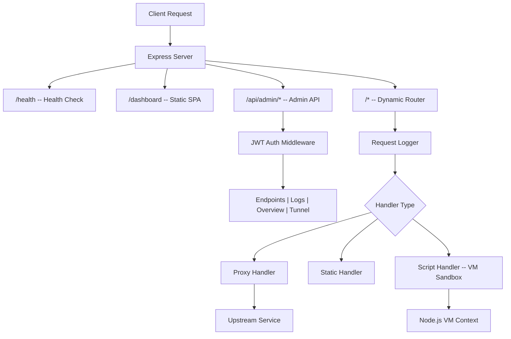

<div align="center">
  <h1>UvA API Self-Host</h1>
  <p><strong>Self-hosted API gateway with University of Amsterdam authentication and Cloudflare Tunnel integration</strong></p>
  <p>
    <a href="#getting-started"></a>
    <a href="#architecture"></a>
    <a href="#configuration"></a>
    <a href="#cloudflare-tunnel"></a>
  </p>
</div>

---

## About

UvA API Self-Host is a lightweight, single-user API gateway that lets you define, manage, and expose custom HTTP endpoints through a web-based dashboard. Authentication is handled entirely through existing University of Amsterdam institutional accounts -- the system extracts session cookies from Firefox and Chrome, validates them against the UvA session API, and issues local JWTs for dashboard access. This eliminates the need for a separate user database or password management. Each endpoint can be configured as a reverse proxy to an upstream service, a static JSON responder, or a sandboxed JavaScript handler that executes user-provided code in a Node.js VM with a 10-second timeout. The built-in Cloudflare Tunnel integration allows the gateway to be exposed to the internet without port forwarding, supporting both temporary quick tunnels and named tunnels with custom domains. All request traffic is logged to a local SQLite database with per-endpoint filtering and aggregate statistics available through the dashboard.

## Table of Contents

- [About](#about)
- [Key Features](#key-features)
- [Architecture](#architecture)
  - [Request Flow](#request-flow)
  - [Repository Structure](#repository-structure)
- [API Reference](#api-reference)
  - [Health Check](#health-check)
  - [Authentication](#authentication)
  - [Endpoints Management](#endpoints-management)
  - [Request Logs](#request-logs)
  - [Dashboard Overview](#dashboard-overview)
  - [Tunnel Management](#tunnel-management)
- [Configuration](#configuration)
- [Getting Started](#getting-started)
  - [Prerequisites](#prerequisites)
  - [Installation](#installation)
  - [Running](#running)
- [Cloudflare Tunnel](#cloudflare-tunnel)
- [Endpoint Handler Types](#endpoint-handler-types)
- [Contact](#contact)

## Key Features

- **Browser-based UvA authentication** -- Extracts session cookies directly from Firefox and Chrome cookie databases, validates them against the UvA session API, and issues local JWTs. No passwords, no OAuth configuration, no external identity provider required.

- **Three endpoint handler types** -- Proxy requests to upstream services, return static JSON/text responses, or execute arbitrary JavaScript in a sandboxed VM with controlled access to request data and a 10-second execution timeout.

- **Zero-downtime endpoint management** -- The dynamic router rebuilds itself from the database on every endpoint change. Create, update, enable, disable, or delete endpoints through the admin API without restarting the server.

- **Cloudflare Tunnel integration** -- Expose the gateway to the internet with a single click from the dashboard. Supports both temporary quick tunnels (auto-generated `.trycloudflare.com` URLs) and persistent named tunnels with custom domains.

- **Request logging and analytics** -- Every request to a custom endpoint is logged with method, path, status code, response time, and client IP. The dashboard provides paginated log browsing, method filtering, and aggregate statistics.

- **Single-file SQLite persistence** -- All endpoint definitions, request logs, and sessions are stored in a single `gateway.db` file. No external database server required.

## Architecture

### Request Flow



### Repository Structure

<details>
<summary>Directory layout</summary>

```
uva-api-self-host/
+-- server.js                       # Express app entry point
+-- package.json                    # Node.js dependencies and scripts
+-- .env.example                    # Environment variable template
+-- src/
|   +-- config.js                   # Configuration loader, JWT secret generation
|   +-- db.js                       # SQLite initialization and schema
|   +-- dynamic-router.js           # Dynamic endpoint router builder
|   +-- tunnel.js                   # Cloudflare Tunnel process manager
|   +-- auth/
|   |   +-- browser-login.js        # Browser login flow orchestrator
|   |   +-- session-validator.js    # UvA session API validation
|   |   +-- jwt.js                  # JWT token signing and verification
|   |   +-- chrome.js               # Chrome cookie extraction (AES-128-CBC v10)
|   |   +-- firefox.js              # Firefox cookie extraction
|   |   \-- cookie-paths.js         # Browser profile path detection
|   +-- middleware/
|   |   +-- auth.js                 # JWT authentication guard
|   |   +-- logger.js               # Per-endpoint request logging
|   |   \-- error-handler.js        # Global error handler
|   +-- routes/
|   |   +-- admin-auth.js           # Auth routes: login, status, me, logout
|   |   +-- admin-endpoints.js      # Endpoint CRUD routes
|   |   +-- admin-logs.js           # Log query and stats routes
|   |   +-- admin-overview.js       # Dashboard summary statistics
|   |   \-- admin-tunnel.js         # Tunnel start, stop, status routes
|   \-- handlers/
|       +-- proxy-handler.js        # Forward requests to upstream URL
|       +-- static-handler.js       # Return fixed JSON/text responses
|       \-- script-handler.js       # Execute JS in sandboxed VM context
\-- dashboard/
    +-- index.html                  # SPA shell
    +-- css/
    |   +-- style.css               # Base styles
    |   +-- auth.css                # Login page styles
    |   +-- sidebar.css             # Navigation sidebar
    |   +-- endpoints.css           # Endpoint management styles
    |   \-- logs.css                # Log viewer styles
    +-- img/
    |   \-- uva-logo.svg            # University of Amsterdam logo
    \-- js/
        +-- core/
        |   +-- api.js              # HTTP client with token management
        |   +-- app.js              # Application initialization
        |   +-- auth.js             # Auth state and login UI
        |   +-- router.js           # Client-side SPA routing
        |   \-- sidebar.js          # Sidebar toggle state
        \-- views/
            +-- overview.js         # Dashboard statistics view
            +-- endpoints.js        # Endpoint management interface
            +-- logs.js             # Request log viewer
            \-- tunnel.js           # Tunnel status and controls
```

</details>

## API Reference

All admin endpoints (except auth login/status) require a Bearer token in the `Authorization` header:

```
Authorization: Bearer <jwt-token>
```

### Health Check

```
GET /health
```

Returns service status. No authentication required.

**Response:**

```json
{ "status": "ok" }
```

### Authentication

**Start browser login:**

```
POST /api/admin/auth/browser-login
```

Opens the default browser to `aichat.uva.nl` and begins polling for a valid session cookie. Returns immediately.

**Poll login status:**

```
GET /api/admin/auth/browser-status
```

| Field | Type | Description |
|-------|------|-------------|
| `status` | string | `"idle"`, `"pending"`, `"success"`, or `"error"` |
| `token` | string | JWT token (present only when `status` is `"success"`) |
| `email` | string | User email (present only when `status` is `"success"`) |
| `name` | string | User display name (present only when `status` is `"success"`) |

**Cancel login:**

```
POST /api/admin/auth/browser-cancel
```

**Get current user** (requires auth):

```
GET /api/admin/auth/me
```

**Logout** (requires auth):

```
POST /api/admin/auth/logout
```

### Endpoints Management

All routes require authentication.

| Method | Path | Description |
|--------|------|-------------|
| `GET` | `/api/admin/endpoints` | List all endpoints |
| `GET` | `/api/admin/endpoints/:id` | Get a single endpoint |
| `POST` | `/api/admin/endpoints` | Create a new endpoint |
| `PUT` | `/api/admin/endpoints/:id` | Update an endpoint |
| `DELETE` | `/api/admin/endpoints/:id` | Delete an endpoint |

**Create/update request body:**

```json
{
  "method": "GET",
  "path": "/my-api/data",
  "handler_type": "proxy",
  "config": { "target_url": "https://upstream.example.com/data" },
  "description": "Proxy to upstream data service",
  "enabled": true
}
```

| Field | Type | Required | Description |
|-------|------|----------|-------------|
| `method` | string | yes | HTTP method (`GET`, `POST`, `PUT`, `DELETE`, etc.) |
| `path` | string | yes | URL path for the endpoint |
| `handler_type` | string | yes | `"proxy"`, `"static"`, or `"script"` |
| `config` | object | yes | Handler-specific configuration (see [Endpoint Handler Types](#endpoint-handler-types)) |
| `description` | string | no | Human-readable description |
| `enabled` | boolean | no | Whether the endpoint is active (default: `true`) |

### Request Logs

All routes require authentication.

**List logs:**

```
GET /api/admin/logs?limit=50&offset=0&method=GET&endpoint_id=1
```

| Parameter | Type | Required | Description |
|-----------|------|----------|-------------|
| `limit` | integer | no | Results per page (default: 50, max: 200) |
| `offset` | integer | no | Pagination offset |
| `method` | string | no | Filter by HTTP method |
| `endpoint_id` | integer | no | Filter by endpoint ID |

**Aggregate statistics:**

```
GET /api/admin/logs/stats
```

Returns total requests, today's count, average duration, error count, and top endpoints.

### Dashboard Overview

```
GET /api/admin/overview
```

Returns summary statistics: active and total endpoint counts, total requests, today's request count, and tunnel status.

### Tunnel Management

All routes require authentication.

| Method | Path | Description |
|--------|------|-------------|
| `GET` | `/api/admin/tunnel/status` | Get tunnel status and URL |
| `POST` | `/api/admin/tunnel/start` | Start a Cloudflare Tunnel |
| `POST` | `/api/admin/tunnel/stop` | Stop the running tunnel |

**Status response fields:**

| Field | Type | Description |
|-------|------|-------------|
| `status` | string | `"stopped"`, `"starting"`, `"running"`, or `"error"` |
| `url` | string | Public tunnel URL (present when running a quick tunnel) |
| `error` | string | Error message (present when status is `"error"`) |

## Configuration

| Variable | Description | Required | Default |
|----------|-------------|----------|---------|
| `PORT` | Server bind port | no | `3000` |
| `JWT_SECRET` | Signing key for session JWTs | no | Auto-generated on first run |
| `CLOUDFLARED_CONFIG` | Path to `cloudflared` config file for named tunnels | no | -- |

The `JWT_SECRET` is automatically generated and persisted to `.env` if not explicitly set.

See [`.env.example`](.env.example) for a configuration template.

## Getting Started

### Prerequisites

- **Node.js 18+**
- **npm**
- **cloudflared** (optional -- required only for tunnel functionality)
- A valid **University of Amsterdam** account with access to `aichat.uva.nl`
- **Firefox** or **Chrome/Chromium** installed (for cookie-based authentication)
- **Linux** (cookie extraction uses Linux-specific browser profile paths)

### Installation

```bash
git clone <repository-url>
cd uva-api-self-host
npm install
```

Configure environment variables:

```bash
cp .env.example .env
# Edit .env if you want to change the port or set a custom JWT secret
```

### Running

Start the server:

```bash
npm start
```

Start with auto-reload during development:

```bash
npm run dev
```

Open the dashboard at `http://localhost:3000/dashboard` and click **Login with UvA Account** to authenticate through your browser.

## Cloudflare Tunnel

The gateway integrates with `cloudflared` to expose endpoints to the internet.

**Quick tunnel** (temporary URL, no configuration needed):

1. Install `cloudflared` on your system.
2. Start the tunnel from the dashboard or via `POST /api/admin/tunnel/start`.
3. A temporary `*.trycloudflare.com` URL is assigned automatically.

**Named tunnel** (persistent custom domain):

1. Set up a named tunnel through the Cloudflare dashboard or `cloudflared` CLI.
2. Set `CLOUDFLARED_CONFIG` in `.env` to the path of your `cloudflared` config file.
3. Start the tunnel from the dashboard.

## Endpoint Handler Types

Each custom endpoint uses one of three handler types:

**Proxy** -- Forwards the incoming request to a target URL, preserving method, body, and headers. Strips `host`, `connection`, and `transfer-encoding` headers before forwarding.

```json
{ "target_url": "https://api.example.com/v1/resource" }
```

**Static** -- Returns a fixed response with configurable status code, body, and headers. Useful for mocks and stubs.

```json
{
  "status_code": 200,
  "body": { "message": "Hello from the gateway" },
  "headers": { "X-Custom": "value" }
}
```

**Script** -- Executes user-provided JavaScript in a sandboxed Node.js VM. The script receives a `request` object (method, path, query, headers, body, ip) and must call `response.json()` or `response.send()` to reply. Execution is capped at 10 seconds.

```json
{
  "code": "response.json({ greeting: 'Hello, ' + (request.query.name || 'world') })"
}
```

Available globals in the sandbox: `JSON`, `Math`, `Date`, `parseInt`, `parseFloat`, `encodeURIComponent`, `decodeURIComponent`.

## Contact

<p>
  <a href="https://github.com/moussa"></a>
</p>
